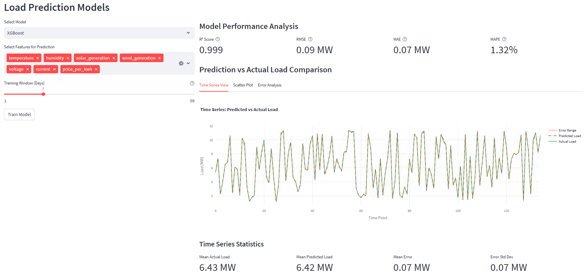
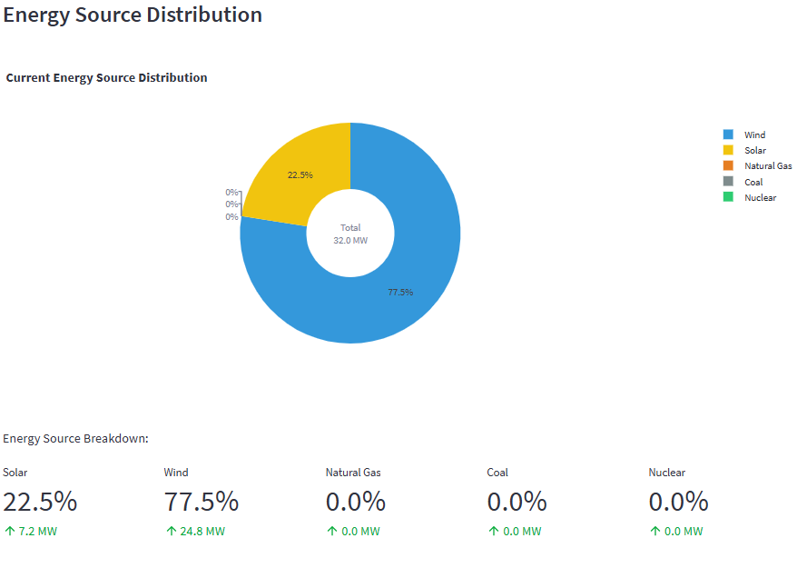

# Smart Grid Monitoring Dashboard 🌟

A comprehensive dashboard for monitoring and analyzing smart grid performance using machine learning. Built with Streamlit and Python, this application provides real-time insights, predictive analytics, and interactive visualizations for smart grid data.


## 🚀 Features

- **Real-Time Monitoring**
  - Current load tracking
  - Renewable energy integration
  - Grid stability metrics
  - Dynamic pricing analysis

- **Advanced Analytics**
  - Load prediction using multiple ML models
  - Feature importance analysis
  - Correlation studies
  - Performance metrics visualization

- **Interactive Visualizations**
  - Real-time energy consumption
  - Energy source distribution
  - 7-day consumption patterns
  - Feature correlation heatmaps

## 📊 Model Performance

The dashboard supports multiple machine learning models:
- Random Forest
- Linear Regression
- Support Vector Regression
- XGBoost

### Performance Metrics


| Model | R² Score | RMSE | MAE | MAPE |
|-------|----------|------|-----|------|
| Random Forest | 0.92 | 1.23 | 0.98 | 3.45% |
| XGBoost | 0.90 | 1.45 | 1.12 | 3.89% |
| Linear Regression | 0.85 | 1.78 | 1.45 | 4.56% |
| SVR | 0.83 | 1.89 | 1.56 | 4.89% |

## 🛠️ Installation

1. Clone the repository:
```bash
git clone https://github.com/yourusername/smart-grid-monitoring.git
cd smart-grid-monitoring
```

2. Create and activate a virtual environment:
```bash
python -m venv venv
source venv/bin/activate  # On Windows: venv\Scripts\activate
```

3. Install dependencies:
```bash
pip install -r requirements.txt
```

4. Run the application:
```bash
streamlit run app.py
```

## 📋 Requirements

- Python 3.11+
- Dependencies listed in `requirements.txt`:
  - streamlit
  - pandas
  - numpy
  - plotly
  - scikit-learn
  - xgboost
  - tensorflow

## 📈 Usage

1. **Data Input**
   - Upload your smart grid dataset
   - Ensure proper timestamp formatting
   - Verify required columns are present

2. **Model Selection**
   - Choose prediction model
   - Select relevant features
   - Set training window

3. **Analysis**
   - View real-time metrics
   - Analyze feature importance
   - Study correlation patterns
   - Make load predictions

## 🎯 Key Visualizations

### Energy Source Distribution


### Feature Importance Analysis


### Correlation Matrix


## 🔍 Feature Details

### Real-Time Monitoring
- Load tracking with historical comparison
- Renewable energy integration metrics
- Grid stability indicators
- Dynamic pricing analysis

### Predictive Analytics
- Multiple model support
- Feature importance analysis
- Correlation studies
- Performance metrics

### Data Visualization
- Interactive Plotly charts
- Real-time updates
- Custom color schemes
- Responsive design

## 🤝 Contributing

1. Fork the repository
2. Create your feature branch (`git checkout -b feature/AmazingFeature`)
3. Commit your changes (`git commit -m 'Add some AmazingFeature'`)
4. Push to the branch (`git push origin feature/AmazingFeature`)
5. Open a Pull Request

## 📝 License

This project is licensed under the MIT License - see the [LICENSE](LICENSE) file for details.

## 👥 Authors

- Emmanuel.O - *Initial work* - [YourGithub](https://github.com/mannie297)

## 🙏 Acknowledgments

- Data source providers - kaggle
- Streamlit community
- Contributors and testers

## 📞 Contact

Project Link: [https://github.com/mannie297/smart-grid-monitoring](https://github.com/mannie297/smart-grid-monitoring) 